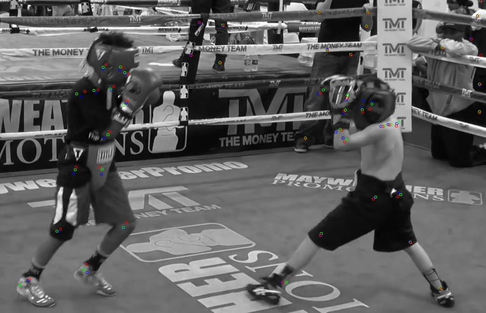
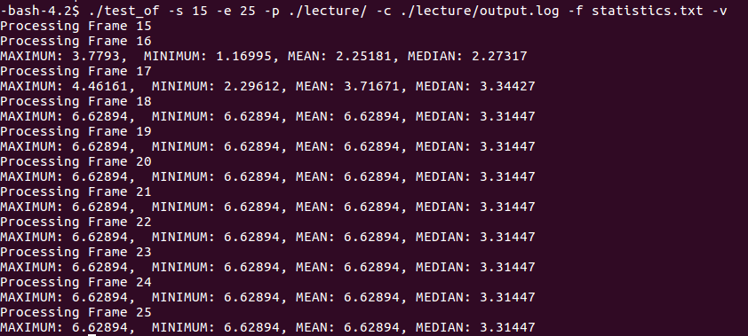
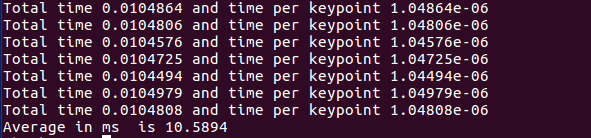

# Custom optical flow Lucas Kanade Pyramidal

    

    This repository includes a CPU and a GPU (NVIDIA) version of the Lucas-Kanade Pyramidal flow algorithm. Besides it provides two test frameworks to test accuracy and performance of both.
    

## Files description
The following files are part of this repository:

- **lkpyramidal.cu**: GPU implementation of LK Pyramidal.
- **test_of.cpp**: Accuracy tester of the custom LK Pyramidal implementation. OpenCV and OpenPose ground truth are shown.
- **test.sh**: Script to run some basic tests and see results.
- **test_of_speed.cpp**: Performance (speed) tester of the custom LK Pyramidal implementation.
- **CMakeLists.txt**: Edit this to decide what to compile (test_of.cpp or test_of_speed.cpp)
- **CycleTimer.h**: Header file used by the performancee tester.
- **Test data directories**: ./data. ./boxing, ./street, ./lecture

## Requirements and compilation

You will need OpenCV installed in your system and OpenCV with CUDA support + CUDA if you are planing to use the GPU version.

To compile the accuracy tester, add the target to CMakeLists.txt:

    CUDA_ADD_EXECUTABLE(test_of test_of.cpp lkpyramidal.cu)
    target_link_libraries( test_of ${CUDA_LIBRARIES} ${OpenCV_LIBS} )

Similarly to compile the speed tester:

    CUDA_ADD_EXECUTABLE(test_of test_of.cpp lkpyramidal.cu)
    target_link_libraries( test_of ${CUDA_LIBRARIES} ${OpenCV_LIBS} )

Every time you modify CMakeLists.txt run :

    cmake .
    make

If you modify files, but don't change CMakeLists.txt it is only required to run make.

prefix='Documents/openpose/output_json/video_'
suffix = '_keypoints.json'
output_file = './output.log'
keypoints = 18
nfiles = 205

## Generating more data

We provide 4 sample videos to test the implementation, but you can generate more data on your own using the following steps:

To generate new data from a particular video. You will first need to get: 
#1 the JPEG or PNG files of each frame of a video (you can get them with VLC).
and 
#2 the OpenPose keypoints as JSON files. To get those run the following using OpenPose (replace VIDEO_NAME and OUTPUT_NAME as required):

    ./build/examples/openpose/openpose.bin --video VIDEO_NAME --write_keypoint_json OUTPUT_NAME --no_display --render_pose 0

Now you need to coalesce the output of all the JSON file into a single TXT file that the tester uses. To do that use  the json2file.py script. Replacing OPEN_POSE_PATH and OUT_FIE_NAME appropiately:

    prefix='OPEN_POSE_PATH/output_json/video_' .
    suffix = '_keypoints.json'
    output_file = 'OUT_FILE_NAME'

## Running the accuracy tester

The following options are provided by the accuracy tester:

- **-s (Mandatory)**: Start frame (initial reference frame for the tracker)
- **-e (Mandatory)**: End frame (last frame where tracker is done)
- **-p (Mandatory)**: Directory path where the data frames are located.
- **-c (Mandatory)**: File containing the coordinates of the Open Pose keypoints for each frame
- **-f**: Stats file. When specified, the tester will calculate statistical measures of the tester in each frame and report them in the file name that goes after the flag.
- **-o**: Output framespath. When specified, the result frame will be saved showing the OpenPose keypoints (blue), custom LK Pyramidal keypoints (red) and OpenCV keypoints (green).
- **-v**: Verbose. Use it with the -f flag to indicate you want verbose output on the console.

Example 1:  

    ./test_of -s 19 -e 29 -p ./boxing/ -c ./boxing/output.log -o ./output/output/ 

will run the accuracy tester from frames 19 to 29, using the frames at the ./boxing/ directory, using the coordinate file ./boxing/output.log and saving the resulting frames at ./output/output

As explained before, the blue points are the Open Pose points (ground truth), the green points are OpenCV pointss withh LKPyramidal-Iterative tracking and the red points our results.

    

Example 2:  

    ./test_of -s 15 -e 25 -p ./lecture/ -c ./lecture/output.log -f statistics.txt -v

will show the statistics of errors with respect to OpenPose (median, minimum, maximum and mean pixel disances) in the screen and will generate statistics.txt (more on that below).

    

You can compare the OpencV vs OpenPose error and the Custom vs OpenPose error by changing the following line on test_of.cpp for either opencv_points or custom_points.

                crd2points(x_of, y_of, opencv_points[1]);

## Plotting the statistics file 

To visualize the statistics per frame using statistics.txt. You can use the plot_all.py script. To run it just replace STATS_PATH at the beggining of the file. This will generate graphs.jpeg with the results:

                with open("STATS_PATH") as f:

## Running the performance test
The performance test can be run by just running ./test_of_speed after it has ben compiled. This program uses the lkpyramidal GPU version and runs it 400 times, each time sampling 10,000 points on an image. The results are compared to those in OpenCV (which runs in the GPU as well).

After running

                ./test_of_speed:

You should see a report of the running time for each of the 400 runs, and then the average time taken by each run (excluding the first two to exclude CUDA initializaiton time).

    

