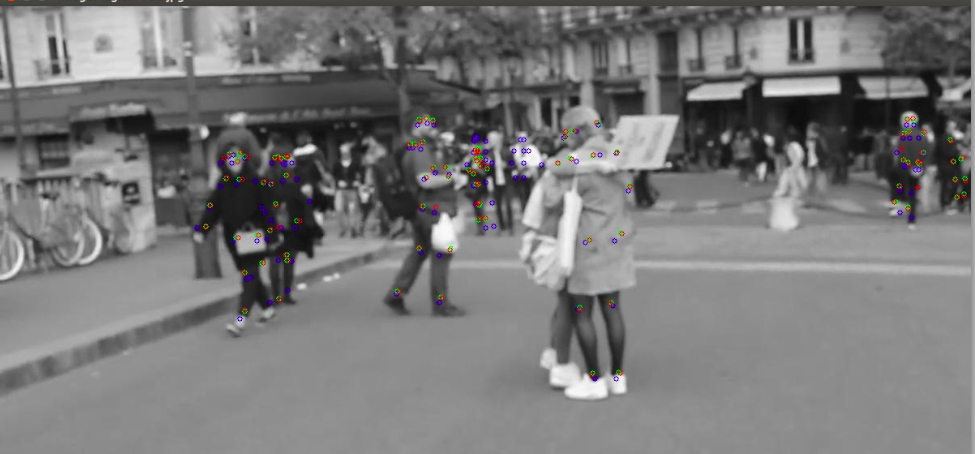

# Custom optical flow Lucas Kanade Pyramidal

    

    This repository includes a CPU and a GPU (NVIDIA) version of the Lucas-Kanade Pyramidal flow algorithm. Besides it provides two test frameworks to test accuracy and performance of both.
    

## Installation, Reinstallation and Uninstallation
     

