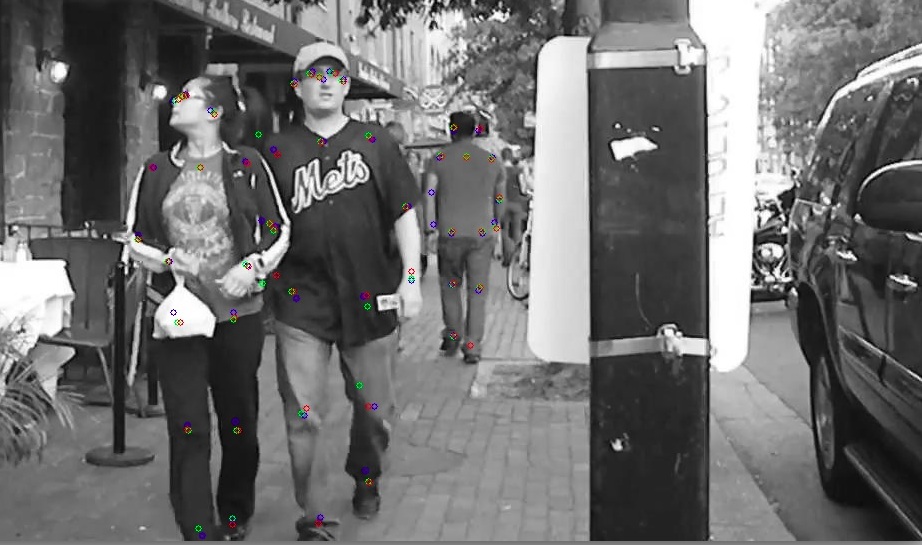

# Custom optical flow Lucas Kanade Pyramidal

    

    This repository includes a CPU and a GPU (NVIDIA) version of the Lucas-Kanade Pyramidal flow algorithm. Besides it provides two test frameworks to test accuracy and performance of both.
    

## Files description
The following files are part of this repository:

- **lkpyramidal.cu**: GPU implementation of LK Pyramidal.
- **test_of.cpp**: Accuracy tester of the custom LK Pyramidal implementation. OpenCV and OpenPose ground truth are shown.
- **test.sh**: Script to run some basic tests and see results.
- **test_of_speed.cpp**: Performance (speed) tester of the custom LK Pyramidal implementation.
- **CMakeLists.txt**: Edit this to decide what to compile (test_of.cpp or test_of_speed.cpp)
- **CycleTimer.h**: Header file used by the performancee tester.
- **Test data directories**: ./data. ./boxing, ./street, ./lecture

## Requirements and compilation

You will need OpenCV installed in your system and OpenCV with CUDA support + CUDA if you are planing to use the GPU version.

To compile the accuracy tester, add the target to CMakeLists.txt:

    CUDA_ADD_EXECUTABLE(test_of test_of.cpp lkpyramidal.cu)
    target_link_libraries( test_of ${CUDA_LIBRARIES} ${OpenCV_LIBS} )

Similarly to compile the speed tester:

    CUDA_ADD_EXECUTABLE(test_of test_of.cpp lkpyramidal.cu)
    target_link_libraries( test_of ${CUDA_LIBRARIES} ${OpenCV_LIBS} )

Every time you modify CMakeLists.txt run :

    cmake .
    make

If you modify files, but don't change CMakeLists.txt it is only required to run make.

## Running the accuracy tester

The following options are provided by the accuracy tester:

- **-s (Mandatory)**: Start frame (initial reference frame for the tracker)
- **-e (Mandatory)**: End frame (last frame where tracker is done)
- **-p (Mandatory)**: Directory path where the data frames are located.
- **-c (Mandatory)**: File containing the coordinates of the Open Pose keypoints for each frame
- **-f**: Stats file. When specified, the tester will calculate statistical measures of the tester in each frame and report them in the file name that goes after the flag.
- **-o**: Output framespath. When specified, the result frame will be saved showing the OpenPose keypoints (blue), custom LK Pyramidal keypoints (red) and OpenCV keypoints (green).
- **-v**: Verbose. Use it with the -f flag to indicate you want verbose output on the console.

For instance  

    ./test_of -s 40 -e 50 -p ./data/ -c ./data/output.log -o ./output/output/ 

will run the accuracy tester from frames 40 to 50, using the frames at the ./data/ directory, using the coordinate file ./data/output.log and saving the resulting frames at ./output/output

